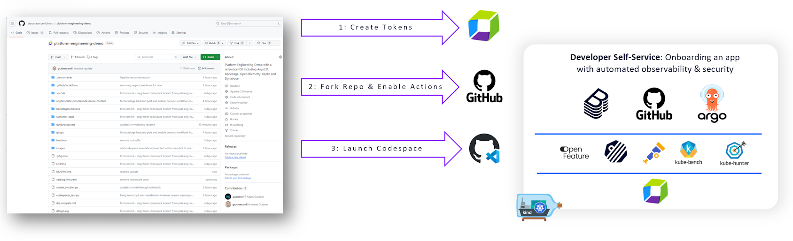

# Platform Engineering Codespaces Demo

**This repo is still work in progress: Got feedback? We welcome contributions and feedback. Create an issue or email devrel@dynatrace.com**

**Kudos go to Adam Gardner ([@agardnerIT](https://github.com/agardnerIT)) for doing most of the technical work and Katharina Sick ([@katharinasick](https://github.com/katharinasick)) for her help with Backstage.**

**Watch a full demo** and more on YouTube as part of [Observability Guide for Platform Engineering - Part 2](https://www.youtube.com/watch?v=YPyRg3Mso6g)

**Download** the [Observability Guide to Platform Engineering eBook](https://dt-url.net/ebook-plateng-angr)

Thanks for being interested in this Platform Engineering Codespace Demo. This demo is a smaller version of our [Platform Engineering Tutorial with Dynatrace](https://github.com/dynatrace-perfclinics/platform-engineering-tutorial) that we delivered for Perform 2024 as a HOTDAY.
This repo stands up a reference IDP (Internal Development Platform) to show case a self-service onboarding and release of applications that are automatically observed and validated with Dynatrace - all with the power of GitHub Codespaces (or any other similiar tool that supports devcontainers).



The tools in this IDP include: 
* GitHub (as your Git repo)
* [Backstage](https://backstage.io/) (as your self-service portal)
* [ArgoCD](https://argoproj.github.io/cd/) (as your GitOps operator)
* [Argo Workflows](https://argoproj.github.io/workflows/) (to trigger post deployment tasks)
* [OpenTelemetry](https://opentelemetry.io) (for standard observability)
* [OpenFeature](https://github.com/open-feature/open-feature-operator/blob/main/docs/installation.md) (for feature flagging)
* [Keptn](https://keptn.sh) (for deployment observability)
* [KubeAudit](https://github.com/Shopify/kubeaudit) (for additional cluster level security checks)
* [KubeHunter](https://github.com/aquasecurity/kube-hunter) (for additional security checks)
* [Dynatrace](https://bit.ly/dtsaastrial) (your observability, security and automation platform)

If you follow all instructions you should have your own IDP running in a GitHub Codespace within about 5-10 minutes!

## Prerequisites

Note: This currently only works in GitHub-hosted devcontainers. It does not run locally (yet). We are [investigating support for this](https://github.com/dynatrace-perfclinics/platform-engineering-demo/issues/5) + [Gitpod support](https://github.com/dynatrace-perfclinics/platform-engineering-demo/issues/6). If you have experience in these areas, we ❤️ contributions so get involved!

### Grail enabled Dynatrace SaaS Tenant

If you don't already have a Grail enabled Dynatrace SaaS tenant, sign up for a free trial here: [free 15 day Dynatrace trial](https://bit.ly/dtsaastrial)

Make a note of the Dynatrace environment name. This is the first part of the URL. `abc12345` would be the environment ID for `https://abc12345.apps.dynatrace.com`

* For those running in other environments (such as `sprint`), make a note of your environment: `dev`, `sprint` or `live`

### Create DT oAuth Client

> The following link will provide some oAuth permissions. To these, please **also** include the following
> - `document:documents:write`
> - `document:documents:read`
> - `automation:workflows:read`
> - `automation:workflows:write`
> - `storage:logs:read`
> - `storage:events:read`
> - `storage:events:write`
> - `storage:metrics:read`
> - `storage:bizevents:read`
> - `storage:bizevents:write`
> - `storage:system:read`
> - `storage:buckets:read`
> - `storage:spans:read`
> - `storage:entities:read`
> - `storage:fieldsets:read`

Follow [the documentation](https://www.dynatrace.com/support/help/platform-modules/business-analytics/ba-api-ingest) to set up an OAuth client + policy + bind to your service user account email.

This is required so that the codespace can create documents (notebooks + dashboards) in Dynatrace and the platform can send business events (aka bizevents) and to Dynatrace.

You should now have 5 pieces of information:

1. A DT environment (`dev`, `sprint` or `live`)
1. A DT environment ID
1. An oAuth client ID
1. An oAuth client secret
1. An account URN

### Create DT API Token

Create a Dynatrace access token with the following permissions. This token will be used by the setup script to automatically create all other required DT tokens.

1. `apiTokens.read`
1. `apiTokens.write`

You should now have 6 pieces of information:

1. A DT environment (`dev`, `sprint` or `live`)
1. A DT environment ID
1. An oAuth client ID
1. An oAuth client secret
1. An account URN
1. An API token

### Fork Repo

Fork this repo.


### ⚠️ Enable Actions in your Fork ⚠️

> ⚠️ This step is important! ⚠️

This demo uses one GitHub action to automatically merge Pull Requests when apps are onboarded.

In your fork, go to `Actions` and click the green button: `I understand my workflows, go ahead and enable them`.


## Setup Instructions

### Create Codespace Secrets

In your fork:

1. Switch to the `main` branch
1. Click the green `Code` button
1. Change to `Codespaces`
1. Click the `...` and choose `New with options...`

**Warning!** Do not click the green "Create codespace on codespace" button!!

Fill in the form and launch the codespace.


If you have **already** defined the environment variables in your repository, you'll see a screen asking you to associate those secrets with this repository. Please check the boxes as shown below.


The codespace will launch in a new browser window.

Wait until the `Running postStartCommand...` disappears. It should take ~10 minutes.

## Usage Instructions

### Login to ArgoCD

Get ArgoCD password:

```
ARGOCDPWD=$(kubectl -n argocd get secret argocd-initial-admin-secret -o jsonpath="{.data.password}" | base64 -d)
echo $ARGOCDPWD
```
The username is: `admin`

Change to `Ports` tab and open ArgoCD (port `30100`) & log in.

### Login to Backstage

Backstage is also available (port `30105`).

### Create An Application

In Backstage (port `30105`), navigate to "Create" and use the "Create a New Application" template.

Backstage will open a Pull Request on GitHub and the [automerge](.github/workflows/automerge.yml) action will immediately merge that PR (for convenience in the demo setup).

The new repo will be templated into the `customer-apps` folder.

When Argo picks up the app, it will become available on port `80`. Click `ports` and open the `Demo App` link.

Append your application name, team name and application environment to the path in the following format:

```
https://CodeSpaceName-80.app.github.dev/simplenodeservice-team01-preprod
```

## Observability of the Codespace

### Self-Test OpenTelemetry traces on startup

The codespace self-tests on startup so look for a trace showing the end-to-end health:

```
https://abc12345.sprint.apps.dynatracelabs.com/ui/apps/dynatrace.classic.distributed.traces/ui/diagnostictools/purepaths?gtf=-30m&gf=all&servicefilter=0%1E50%11codespace-platform%1067%11startup-automated-test
```
1. Open the `Distributed Traces` screen
2. Filter for `Service Name ~ codespace-platform`
3. Filter for `Span name (ingested spans only) ~ startup-automated-test`


### Logs

If something goes wrong setting up the codespace, logs are sent directly to the Dynatrace SaaS ingest endpoint so `fetch logs` to see what went wrong.

## Cleanup / Destroy Resources

TODO. See [this issue](https://github.com/dynatrace-perfclinics/platform-engineering-demo/issues/10).

## How GitHub Codespaces Works + Costs

If you follow the above instructions, a GitHub Codespace will be created under your account. This is effectively a container running on GitHub's cloud infrastructure.

GitHub provides generous free usage limits and (by default) sets the billing limit to $0 (so you cannot be charged without explicit consent).

For most users, there will be absolutely no charge for running this demo. However, we advise deleting the codespace after this tutorial. To do so, go to [https://github.com/codespaces](https://github.com/codespaces) and delete the codespace.

For more information, see [GitHub Codespaces documentation](https://docs.github.com/en/codespaces/overview).

## Debugging

### View Creation Log

```
tail -f /workspaces/.codespaces/.persistedshare/creation.log
```
